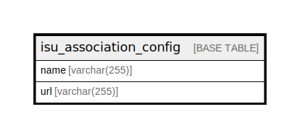

# isu_association_config

## Description

<details>
<summary><strong>Table Definition</strong></summary>

```sql
CREATE TABLE `isu_association_config` (
  `name` varchar(255) NOT NULL,
  `url` varchar(255) NOT NULL,
  PRIMARY KEY (`name`),
  UNIQUE KEY `url` (`url`)
) ENGINE=InnoDB DEFAULT CHARSET=utf8mb4 COLLATE=utf8mb4_general_ci
```

</details>

## Columns

| Name | Type | Default | Nullable | Children | Parents | Comment |
| ---- | ---- | ------- | -------- | -------- | ------- | ------- |
| name | varchar(255) |  | false |  |  |  |
| url | varchar(255) |  | false |  |  |  |

## Constraints

| Name | Type | Definition |
| ---- | ---- | ---------- |
| PRIMARY | PRIMARY KEY | PRIMARY KEY (name) |
| url | UNIQUE | UNIQUE KEY url (url) |

## Indexes

| Name | Definition |
| ---- | ---------- |
| PRIMARY | PRIMARY KEY (name) USING BTREE |
| url | UNIQUE KEY url (url) USING BTREE |

## Relations



---

> Generated by [tbls](https://github.com/k1LoW/tbls)
