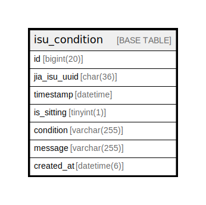

# isu_condition

## Description

<details>
<summary><strong>Table Definition</strong></summary>

```sql
CREATE TABLE `isu_condition` (
  `id` bigint(20) NOT NULL AUTO_INCREMENT,
  `jia_isu_uuid` char(36) NOT NULL,
  `timestamp` datetime NOT NULL,
  `is_sitting` tinyint(1) NOT NULL,
  `condition` varchar(255) NOT NULL,
  `message` varchar(255) NOT NULL,
  `created_at` datetime(6) DEFAULT current_timestamp(6),
  PRIMARY KEY (`id`)
) ENGINE=InnoDB AUTO_INCREMENT=[Redacted by tbls] DEFAULT CHARSET=utf8mb4 COLLATE=utf8mb4_general_ci
```

</details>

## Columns

| Name | Type | Default | Nullable | Extra Definition | Children | Parents | Comment |
| ---- | ---- | ------- | -------- | ---------------- | -------- | ------- | ------- |
| id | bigint(20) |  | false | auto_increment |  |  |  |
| jia_isu_uuid | char(36) |  | false |  |  |  |  |
| timestamp | datetime |  | false |  |  |  |  |
| is_sitting | tinyint(1) |  | false |  |  |  |  |
| condition | varchar(255) |  | false |  |  |  |  |
| message | varchar(255) |  | false |  |  |  |  |
| created_at | datetime(6) | current_timestamp(6) | true |  |  |  |  |

## Constraints

| Name | Type | Definition |
| ---- | ---- | ---------- |
| PRIMARY | PRIMARY KEY | PRIMARY KEY (id) |

## Indexes

| Name | Definition |
| ---- | ---------- |
| PRIMARY | PRIMARY KEY (id) USING BTREE |

## Relations



---

> Generated by [tbls](https://github.com/k1LoW/tbls)
