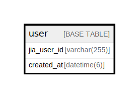

# user

## Description

<details>
<summary><strong>Table Definition</strong></summary>

```sql
CREATE TABLE `user` (
  `jia_user_id` varchar(255) NOT NULL,
  `created_at` datetime(6) DEFAULT current_timestamp(6),
  PRIMARY KEY (`jia_user_id`)
) ENGINE=InnoDB DEFAULT CHARSET=utf8mb4 COLLATE=utf8mb4_general_ci
```

</details>

## Columns

| Name | Type | Default | Nullable | Children | Parents | Comment |
| ---- | ---- | ------- | -------- | -------- | ------- | ------- |
| jia_user_id | varchar(255) |  | false |  |  |  |
| created_at | datetime(6) | current_timestamp(6) | true |  |  |  |

## Constraints

| Name | Type | Definition |
| ---- | ---- | ---------- |
| PRIMARY | PRIMARY KEY | PRIMARY KEY (jia_user_id) |

## Indexes

| Name | Definition |
| ---- | ---------- |
| PRIMARY | PRIMARY KEY (jia_user_id) USING BTREE |

## Relations



---

> Generated by [tbls](https://github.com/k1LoW/tbls)
